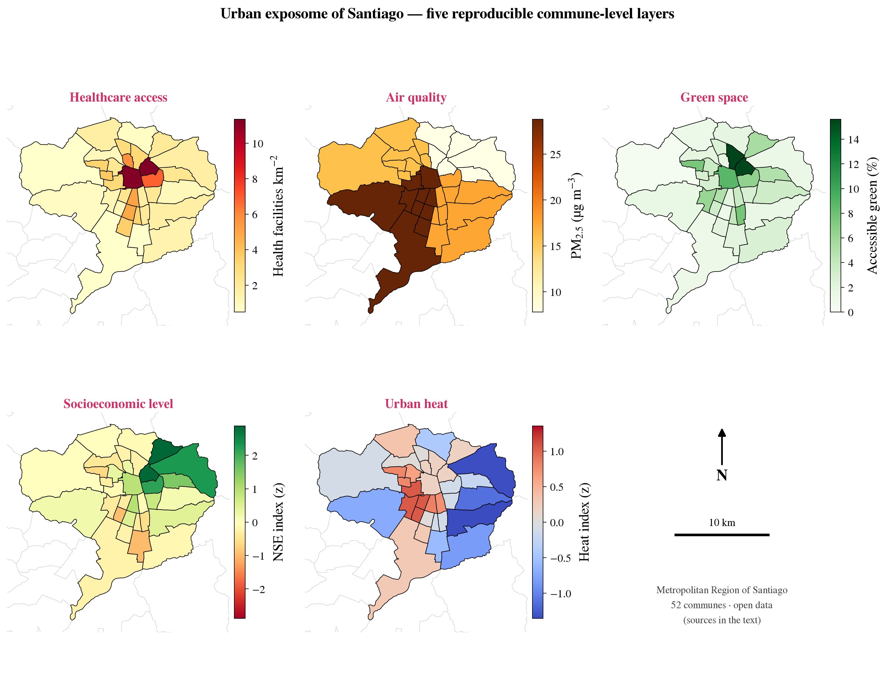

# Santiago Urban Exposome Demo

Proyecto demostrativo para una postulación a **Data Scientist in Brain Health and Exposome Data Analysis**.

El objetivo es mostrar un flujo reproducible para construir indicadores comunales del **exposoma urbano** en la Región Metropolitana de Santiago, usando fuentes abiertas, geoprocesamiento en Python y salidas listas para integrarse con datos clínicos, cognitivos o epidemiológicos.

## Qué Demuestra

- Identificación y descarga de datos abiertos geoespaciales.
- Harmonización de indicadores en una unidad común: las 52 comunas de la RM.
- Construcción de capas ambientales, sociales e infraestructurales del exposoma.
- Exportación en formatos tabulares y GIS (`CSV`, `GeoJSON`, mapas `PNG/HTML`).
- Integración final en una tabla maestra lista para modelamiento estadístico.

## Capas Del Exposoma

| Notebook | Factor | Indicadores principales | Fuente |
|---|---|---|---|
| `santiago_air_quality.ipynb` | Calidad del aire | PM2.5, NO2, razón OMS | Open-Meteo/CAMS, SINCA |
| `santiago_green_spaces.ipynb` | Áreas verdes | % área verde, km2, número de polígonos | OpenStreetMap |
| `santiago_healthcare_access.ipynb` | Acceso a salud | conteos, densidad, distancia media/mediana/P90 a salud y hospital | OpenStreetMap |
| `santiago_socioeconomic.ipynb` | Nivel socioeconómico | pobreza, ingreso, escolaridad, índice NSE | CASEN/SAE vía datos abiertos |
| `santiago_climate_heat_exposure.ipynb` | Clima/calor urbano | Tmax verano, días >=30/35 C, noches cálidas, índice de calor | Open-Meteo Historical |

## Salida Principal

La salida integrada está en:

- `santiago_exposome_master.csv`: 52 comunas x 43 columnas, sin valores faltantes.
- `santiago_exposome_master.geojson`: la misma tabla con geometría comunal.
- `santiago_exposome_master_metadata.json`: fuentes, capas y columnas usadas.

Se regenera con:

```bash
python scripts/build_master_exposome.py
```

## Documento De Demostración

`demo_document/exposome_demo.pdf` (fuente LaTeX en `demo_document/exposome_demo.tex`) es el documento de 4 páginas para adjuntar a la postulación: una figura de 5 paneles con las cinco capas, mini-secciones que explican qué representa cada barra de color y cómo se calcula, las fuentes de datos, y una sección sobre cómo perfeccionar el demo con datos satelitales de dominio temporal (NDVI Sentinel-2, Sentinel-5P, LST). Se compila con `latexmk -pdf exposome_demo.tex`.

## Vista Rápida




## Outputs Relevantes

| Archivo | Contenido |
|---|---|
| `air_quality_exposome_rm_santiago.csv` | indicadores de PM2.5/NO2 por comuna |
| `green_exposome_rm_santiago.csv` | indicadores de áreas verdes por comuna |
| `healthcare_exposome_rm_santiago.csv` | acceso a salud con conteos, densidad y distancias |
| `socioeconomic_exposome_rm_santiago.csv` | pobreza, ingreso, escolaridad e índice NSE |
| `climate_heat_exposome_rm_santiago.csv` | exposición a calor y clima |
| `*_exposome_rm_santiago.geojson` | capas GIS equivalentes |
| `*_santiago_pub.png` | mapas estáticos para presentación/publicación |
| `*_santiago.html` | mapas interactivos |

## Reproducibilidad

Crear entorno con conda/mamba:

```bash
conda env create -f environment.yml
conda activate demo-exposome
python -m ipykernel install --user --name demo-exposome --display-name "Demo Exposome"
```

Orden sugerido de ejecución:

```text
1. santiago_healthcare_access.ipynb
2. santiago_air_quality.ipynb
3. santiago_green_spaces.ipynb
4. santiago_socioeconomic.ipynb
5. santiago_climate_heat_exposure.ipynb
6. santiago_greenspace_cv.ipynb  # optional computer-vision example
7. python scripts/build_master_exposome.py
```

Los notebooks usan caché local cuando existe, pero el directorio `cache/` queda fuera de Git para no publicar respuestas crudas de APIs ni archivos temporales.

## Decisiones Metodológicas

- Unidad geográfica común: comuna (`name`).
- CRS métrico para áreas/distancias: `EPSG:32719`.
- CRS de exportación GIS: WGS84 (`EPSG:4326`).
- Acceso a salud: distancias calculadas sobre grilla intra-comunal de 1 km.
- Calor urbano: proxy residencial = media de la **banda baja (valle poblado, ≤300 m sobre el punto más bajo)** de cada comuna, excluyendo píxeles de alta cordillera que sesgarían a las comunas precordilleranas grandes (San José de Maipo, Lo Barnechea); punto representativo como fallback para comunas pequeñas sin grilla interior.
- Tabla maestra: merge `one_to_one` por nombre de comuna y validación estricta de 52 filas sin missing.

## Limitaciones

- Los indicadores son ecológicos/comunales; no reemplazan exposición individual residencial exacta.
- OpenStreetMap puede tener subregistro diferencial por comuna.
- Las capas climáticas y de aire provienen de reanálisis/grillas, no de micro-sensores intraurbanos.
- El apéndice Google Earth Engine en clima/verde es opcional y requiere autenticación externa.

## Relevancia Para Investigación En Exposoma

Este proyecto traduce una necesidad de investigación en exposoma urbano a un prototipo funcional: toma fuentes abiertas, genera indicadores ambientales/sociales/infraestructurales, los harmoniza en una unidad común y produce una base lista para cruzarse con cohortes, datos cognitivos, biomarcadores o neuroimagen.
