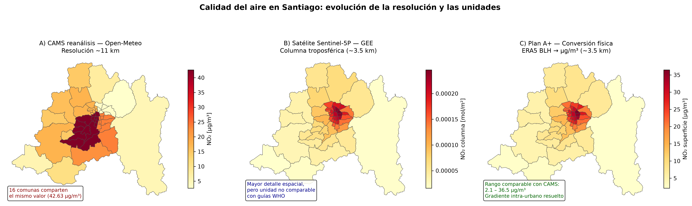
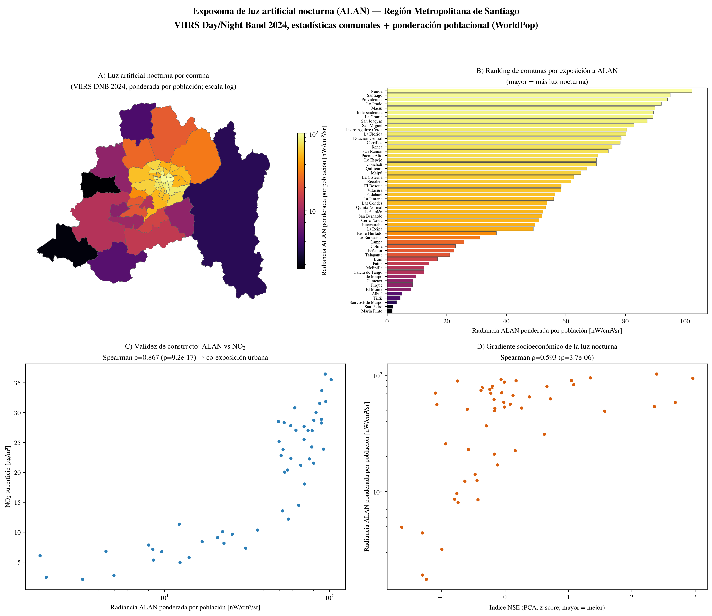
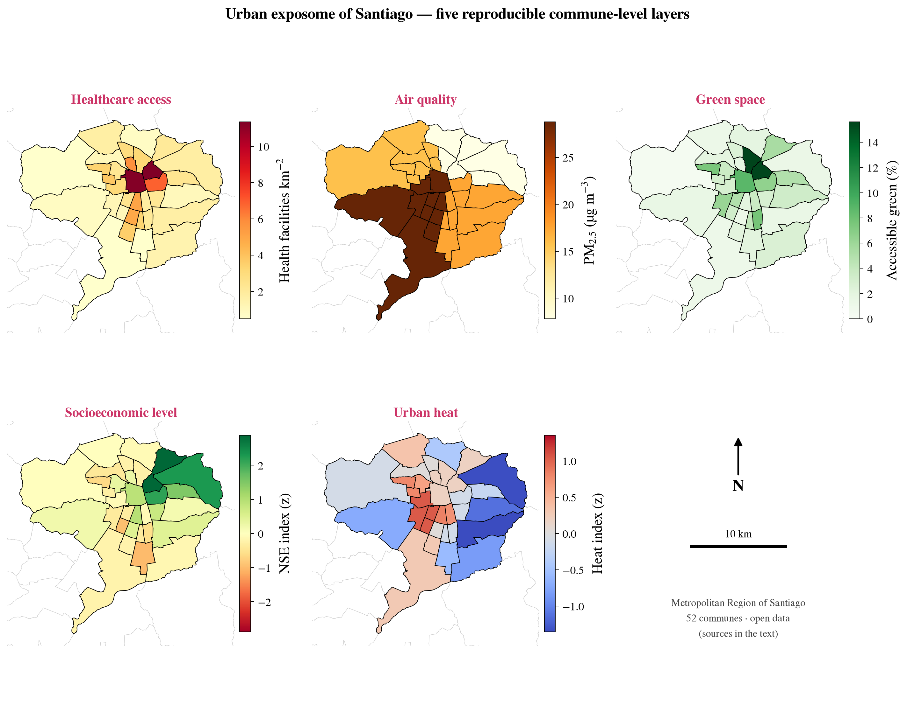

# Santiago Urban Exposome Demo


El objetivo es mostrar un flujo reproducible para construir indicadores comunales del **exposoma urbano** en la Región Metropolitana de Santiago, usando fuentes abiertas, geoprocesamiento en Python y salidas listas para integrarse con datos clínicos, cognitivos o epidemiológicos.

## Qué Demuestra

- Identificación y descarga de datos abiertos geoespaciales.
- Harmonización de indicadores en una unidad común: las 52 comunas de la RM.
- Construcción de capas ambientales, sociales e infraestructurales del exposoma.
- Exportación en formatos tabulares y GIS (`CSV`, `GeoJSON`, mapas `PNG/HTML`).
- Integración final en una tabla maestra lista para modelamiento estadístico.

## Capas Del Exposoma

| Notebook / Script | Factor | Indicadores principales | Fuente |
|---|---|---|---|
| `notebooks/santiago_air_quality.ipynb` | Calidad del aire (legacy) | PM2.5, NO2, razón OMS | Open-Meteo/CAMS, SINCA |
| **`scripts/run_air_quality.py`** | **Calidad del aire (Plan A+)** | **NO₂ columna + superficie [µg/m³], AOD** | **GEE: Sentinel-5P + MODIS + ERA5** |
| **`scripts/run_pm25.py`** | **PM₂.₅ crónico (alta resolución)** | **PM₂.₅ medio y ponderado por población [µg/m³], razón WHO** | **GEE: ACAG/van Donkelaar ~1 km (media 2015–2022)** |
| **`scripts/run_alan.py`** | **Luz artificial nocturna (ALAN)** | **radiancia media/mediana/sd/máx y ponderada por población [nW/cm²/sr]** | **GEE: VIIRS DNB + WorldPop** |
| **`scripts/run_precipitation.py`** | **Precipitación** | **lluvia anual, días húmedos/intensos, RX1/RX5, rachas secas/húmedas, anomalía 2024** | **GEE: CHIRPS diario** |
| **`scripts/run_sleep_context.py`** | **Contexto sueño-circadiano** | **índice ambiental 0-100 basado en ALAN, noches cálidas y vulnerabilidad** | **Capas procesadas + ENS/ENUT como contexto regional** |
| **`scripts/run_wildfire.py`** | **Desastres climáticos — incendios forestales** | **área quemada km²/%, recurrencia, focos activos, índice de exposición 0-100** | **GEE: MODIS MCD64A1 + FIRMS (+ CONAF opcional)** |
| **`scripts/run_heavy_metals.py`** | **Metales pesados industriales (RETC)** | **Pb, As, Hg en kg/yr; log(Pb+1); índice compuesto; n fuentes** | **MMA RETC — fuentes puntuales 2015–2022** |
| **`scripts/run_neuro_mortality.py`** | **Comparador sanitario — mortalidad neurológica** | **tasas comunales de demencia, Alzheimer, ACV y parkinsonismo** | **DEIS defunciones** |
| **`scripts/run_neuro_hospitalizations.py`** | **Comparador sanitario — egresos neuropsiquiátricos** | **tasas comunales de hospitalización mental, ACV, demencia, ánimo, psicosis, sustancias** | **DEIS egresos hospitalarios** |
| `notebooks/santiago_green_spaces.ipynb` | Áreas verdes | % área verde, km2, número de polígonos | OpenStreetMap |
| `notebooks/santiago_healthcare_access.ipynb` | Acceso a salud | conteos, densidad, distancia media/mediana/P90 a salud y hospital | OpenStreetMap |
| `notebooks/santiago_socioeconomic.ipynb` | Nivel socioeconómico | pobreza, ingreso, escolaridad, índice NSE | CASEN/SAE vía datos abiertos |
| `notebooks/santiago_climate_heat_exposure.ipynb` | Clima/calor urbano | Tmax verano, días >=30/35 C, noches cálidas, índice de calor | Open-Meteo Historical |

## Mejora de calidad del aire — Plan A+ (satélite + conversión física)

Identificamos que la fuente CAMS usada en el notebook original tiene **resolución ~11 km**, lo que agrupa ~20 comunas en el mismo valor y oculta el gradiente intra-urbano.

Implementamos un **pipeline configurable** que integra satélites de mayor resolución y los convierte a unidades epidemiológicamente interpretables:

```bash
# Requiere entorno 'exposome' con GEE autenticado
python scripts/run_air_quality.py
```

**Qué hace:**
1. Lee la configuración de ciudad desde `config/cities/santiago.yaml`.
2. Usa los límites comunales ya procesados (evita re-descargar de OSM).
3. Extrae **NO₂ troposférico** de **Sentinel-5P TROPOMI** (~3.5 km) vía Google Earth Engine.
4. Extrae **AOD** (profundidad óptica de aerosoles) de **MODIS MCD19A2** (~3 km).
5. Extrae **altura de capa de mezcla** (BLH) de **ERA5** para convertir NO₂ columna → **concentración superficial en µg/m³**.
6. Calcula estadísticas zonales por comuna y exporta `data/processed/santiago_air_quality_satellite_2024.{csv,geojson}`.

**Figura evolutiva de tres paneles:**



> **Panel A:** CAMS legacy (~11 km) en µg/m³. **Panel B:** Sentinel-5P columna (mol/m²) — más detalle espacial pero unidades no comparables. **Panel C:** Plan A+ — mismo detalle espacial pero convertido a µg/m³ mediante BLH de ERA5, directamente comparable con guías WHO.

**Metodología completa:** `docs/plan_a_plus_methodology.md` explica la física de la conversión, los supuestos, las limitaciones y las referencias.

**Plan B (futuro):**  Documentado en `docs/plan_b_downscaling.md`.  Consiste en un modelo de ML espacial (Random Forest / XGBoost) que calibra el proxy satelital con estaciones SINCA para llegar a **~1 km de resolución** y estimar PM₂.₅ y NO₂ de superficie.

## Luz artificial nocturna (ALAN) — VIIRS DNB

Nueva capa del exposoma urbano, especialmente relevante para salud cerebral (disrupción circadiana, supresión de melatonina, sueño → deterioro cognitivo, demencia, depresión, ACV). Se construye con la banda Día/Noche de VIIRS vía GEE y se pondera por población (WorldPop).

```bash
# Requiere entorno 'exposome' con GEE autenticado
python scripts/run_alan.py        # capa comunal santiago_alan_viirs_2024.{csv,geojson}
python scripts/plot_alan_map.py   # figura de 4 paneles
```



> **A)** Radiancia ponderada por población (escala log): centro denso brillante, periferia rural oscura. **B)** Ranking de las 52 comunas. **C)** Validez de constructo vs NO₂ de superficie (Spearman ρ≈+0.87). **D)** Gradiente socioeconómico de la exposición a luz.

**Metodología completa:** `docs/alan_methodology.md`.

## PM₂.₅ crónico de alta resolución — ACAG vía GEE

PM₂.₅ es la exposición ambiental #1 ligada a demencia (Lancet Commission 2024).
El repo ya estimaba NO₂ de superficie a ~3.5 km, pero su único PM₂.₅ venía del
CAMS legacy (~11 km), que agrupa ~20 comunas en el mismo valor. Esta capa lo
reemplaza por PM₂.₅ satelital **ACAG/van Donkelaar a ~1 km**, promediado en una
ventana **crónica 2015–2022** (la ventana de exposición correcta para
envejecimiento cerebral), accedido como *asset* del mismo Google Earth Engine que
ya usa el proyecto (sin API key adicional) y ponderado por población (WorldPop).

```bash
# Requiere entorno 'exposome' con GEE autenticado
python scripts/run_pm25.py          # santiago_pm25_acag_2015_2022.{csv,geojson,json}
python scripts/build_master_exposome.py  # PM₂.₅ pasa a ser el pm25_* canónico del master
python scripts/plot_pm25_map.py     # figura de 4 paneles (mapa, ranking, validación, NSE)
```

Indicadores: `pm25_mean`, `pm25_pop_weighted`, `pm25_who_ratio`. La validación
contra estaciones SINCA es opcional (deja `data/raw/stations_sinca/sinca_pm25_annual.csv`
con `station, lat, lon, pm25`); sin ese archivo la figura cae a validez de
constructo vs NO₂. El PM₂.₅ grueso de CAMS se retira del master pero se conserva
el CSV/figura legacy para la comparación CAMS-vs-satélite.

**Metodología completa:** `docs/pm25_methodology.md`.

## Precipitación — CHIRPS diario

Nueva capa comunal de precipitación para vigilar humedad, sequía y eventos de
lluvia intensa como exposiciones ambientales candidatas para análisis
cerebro-exposoma. La capa usa CHIRPS diario vía Google Earth Engine y resume
2015-2024 por comuna.

```bash
# Requiere entorno 'exposome' con GEE autenticado
python scripts/run_precipitation.py       # santiago_precipitation_chirps_2015_2024.{csv,geojson,json}
python scripts/plot_precipitation_maps.py # figura de 4 paneles
```

Indicadores principales: precipitación anual media, variabilidad interanual,
días húmedos, días con lluvia >=10/20 mm, RX1day, RX5day, rachas secas/húmedas,
lluvia de invierno/verano, anomalía del año más reciente e índice de extremos
0-100. La capa queda integrada al master como exposición exploratoria lista
para cruzarse con cohortes, neuropsicología, biomarcadores o neuroimagen.

**Metodología completa:** `docs/precipitation_methodology.md`.

## Contexto sueño-circadiano

Nueva capa comunal que resume condiciones urbanas asociadas a peor sueño, sin
estimar horas de sueño ni prevalencia clínica por comuna. Combina luz artificial
nocturna ponderada por población, noches tropicales, temperatura mínima de
verano y vulnerabilidad social en un índice 0-100.

```bash
python scripts/build_master_exposome.py  # asegura insumos integrados
python scripts/run_sleep_context.py      # data/processed/santiago_sleep_context.{csv,geojson}
python scripts/build_master_exposome.py  # incorpora sleep_* al master
python scripts/plot_sleep_context.py     # figura diagnóstica opcional
```

La ENS/ENUT se usa como evidencia y validación regional, no como imputación
comunal. **Metodología completa:** `docs/sleep_context_methodology.md`.

## Metales pesados industriales — RETC (MMA)

Nueva capa de **toxinas industriales** para investigación en salud cerebral.
El Plomo (Pb) es el neurotóxico #1 de la Lancet Commission 2024; el Arsénico
(As) y el Mercurio (Hg) tienen evidencia emergente de daño al SNC.

```bash
python scripts/run_heavy_metals.py   # santiago_heavy_metals_retc_2015_2022.{csv,geojson,json}
python scripts/plot_heavy_metals_map.py  # figura de 4 paneles
```

Fuente: **RETC MMA** (`datosretc.mma.gob.cl`), emisiones al aire de fuentes
puntuales 2015–2022, licencia CC-BY, sin API key. Geocodificación por
punto-en-polígono comunal con fallback a comuna más cercana.

Hallazgos clave:
- **Tiltil** concentra ~99.6% de las emisiones de Pb del RM (~10,629 kg/yr),
  correspondiente a un complejo industrial conocido.
- **Mn y Cd = 0 en RM**: sus fuentes industriales están en otras regiones
  (Atacama, Maule) — hallazgo real, no error.
- **Pb vs PM₂.₅**: ρ = −0.15 (p = 0.30, n.s.) — las fuentes industriales
  y la combustión de fondo **no co-localizan**, confirmando que RETC añade
  información exposómica independiente.

Indicadores: `hm_pb_kg`, `hm_as_kg`, `hm_hg_kg`, `hm_pb_log`, `hm_as_log`,
`n_sources`, `hm_index` (z-score ponderado). **Metodología completa:**
`docs/heavy_metals_methodology.md`.

## Comparadores Sanitarios DEIS

Los archivos de defunciones y egresos hospitalarios se usan como desenlaces
ecológicos externos, no como capas del exposoma. Los CSV crudos grandes viven en
`data/raw/deis/` y no se versionan en git.

```bash
python scripts/run_neuro_mortality.py
python scripts/compare_neuro_mortality_exposome.py

python scripts/run_neuro_hospitalizations.py
python scripts/compare_neuro_hospitalizations_exposome.py
```

La mortalidad sirve mejor para desenlaces neurológicos duros (demencia,
Alzheimer, ACV, parkinsonismo). Los egresos hospitalarios son la fuente más útil
para morbilidad mental no fatal (trastornos del ánimo, psicosis, sustancias,
ansiedad/estrés). **Metodología completa:** `docs/neuro_outcomes_methodology.md`.

---

## Salida Principal

La salida integrada está en:

- `santiago_exposome_master.csv`: tabla comunal integrada, sin valores faltantes en columnas base.
- `santiago_exposome_master.geojson`: la misma tabla con geometría comunal.
- `santiago_exposome_master_metadata.json`: fuentes, capas y columnas usadas.

Todos estos archivos están en `data/processed/`.

Se regenera con:

```bash
python scripts/build_master_exposome.py
```

## Documento De Demostración

`demo_document/exposome_demo.pdf` (fuente LaTeX en `demo_document/exposome_demo.tex`) es el documento de 4 páginas para adjuntar a la postulación: una figura de 5 paneles con las cinco capas, mini-secciones que explican qué representa cada barra de color y cómo se calcula, las fuentes de datos, y una sección sobre cómo perfeccionar el demo con datos satelitales de dominio temporal (NDVI Sentinel-2, Sentinel-5P, LST). Se compila con `latexmk -pdf exposome_demo.tex`.

## Vista Rápida




## Estructura Del Repositorio

```text
notebooks/       notebooks reproducibles, uno por capa del exposoma
data/processed/  tablas CSV, capas GeoJSON y metadata final
figures/         mapas estáticos, rankings y figuras de integración
maps/            mapas interactivos HTML
demo_document/   PDF adjunto, fuente LaTeX, bibliografía y figuras del documento
docs/            documentos auxiliares de postulación
scripts/         utilidades reproducibles, incluida la integración maestra
```

## Outputs Relevantes

| Archivo | Contenido |
|---|---|
| `data/processed/air_quality_exposome_rm_santiago.csv` | indicadores legacy de PM2.5/NO2 por comuna (CAMS) |
| `data/processed/santiago_air_quality_satellite_2024.csv` | NO₂ columna + superficie [µg/m³], AOD (satélite) |
| `data/processed/santiago_pm25_acag_2015_2022.csv` | PM₂.₅ crónico ~1 km, medio y ponderado por población (ACAG) |
| `data/processed/santiago_alan_viirs_2024.csv` | luz artificial nocturna (radiancia VIIRS DNB) por comuna |
| `data/processed/santiago_precipitation_chirps_2015_2024.csv` | precipitación CHIRPS 2015-2024 por comuna |
| `data/processed/santiago_sleep_context.csv` | índice comunal de contexto ambiental sueño-circadiano |
| `data/processed/santiago_wildfire_2015_2024.csv` | exposición a incendios forestales por comuna (área quemada, focos, índice 0-100) |
| `data/processed/santiago_heavy_metals_retc_2015_2022.csv` | emisiones industriales de Pb/As/Hg por comuna (RETC 2015–2022) |
| `data/processed/santiago_neuro_mortality_2018_2022.csv` | comparador comunal de mortalidad neurológica DEIS |
| `data/processed/santiago_neuro_hospitalizations_2006_2006.csv` | comparador comunal de egresos neuropsiquiátricos DEIS |
| `data/processed/santiago_neuro_hospitalizations_exposome_correlations.csv` | correlaciones egresos neuropsiquiátricos vs exposoma |
| `data/processed/green_exposome_rm_santiago.csv` | indicadores de áreas verdes por comuna |
| `data/processed/healthcare_exposome_rm_santiago.csv` | acceso a salud con conteos, densidad y distancias |
| `data/processed/socioeconomic_exposome_rm_santiago.csv` | pobreza, ingreso, escolaridad e índice NSE |
| `data/processed/climate_heat_exposome_rm_santiago.csv` | exposición a calor y clima |
| `data/processed/*_exposome_rm_santiago.geojson` | capas GIS equivalentes |
| `figures/*_santiago_pub.png` | mapas estáticos para presentación/publicación |
| `maps/*_santiago.html` | mapas interactivos |

## Reproducibilidad

### Entorno de desarrollo (nuevo: `exposome` con Python 3.12)

El proyecto usa un entorno Conda independiente llamado **`exposome`** con Python 3.12, configurado para soportar Google Earth Engine, OpenAQ y el stack geoespacial completo.

```bash
# Crear entorno (usar mamba es más rápido)
mamba env create -f environment.yml

# Activar
mamba activate /Users/bastianayalainostroza/Dropbox/Brainlat/.conda/envs/exposome

# Verificar
python -c "import ee; ee.Initialize(project='exposome-api'); print('GEE OK')"
```

> **Nota:** El entorno anterior `demo-exposome` (Python 3.11) sigue disponible en `.conda/envs/brainlat` por compatibilidad, pero todo el desarrollo nuevo debe usar el entorno `exposome`.

### Jupyter Kernel

El kernel ya está instalado. En Jupyter Lab selecciona:

> **Python 3.12 (exposome)**

Para reinstalarlo manualmente:

```bash
mamba run -p .conda/envs/exposome python -m ipykernel install --user --name exposome --display-name "Python 3.12 (exposome)"
```

Orden sugerido de ejecución:

```text
1. notebooks/santiago_healthcare_access.ipynb
2. notebooks/santiago_air_quality.ipynb
3. notebooks/santiago_green_spaces.ipynb
4. notebooks/santiago_socioeconomic.ipynb
5. notebooks/santiago_climate_heat_exposure.ipynb
6. notebooks/santiago_greenspace_cv.ipynb  # optional computer-vision example
7. python scripts/run_alan.py
8. python scripts/run_precipitation.py
9. python scripts/run_climate_openmeteo.py
10. python scripts/run_wildfire.py
11. python scripts/run_heavy_metals.py
12. python scripts/build_master_exposome.py
13. python scripts/run_sleep_context.py
14. python scripts/build_master_exposome.py
```

Ejecutar desde la raíz del repositorio para que las rutas relativas apunten a `data/processed/`, `figures/`, `maps/` y `cache/`. Los notebooks usan caché local cuando existe, pero el directorio `cache/` queda fuera de Git para no publicar respuestas crudas de APIs ni archivos temporales.

> **Google Earth Engine:** El entorno `exposome` está preconfigurado con GEE y el proyecto `exposome-api`. Si necesitas reautenticar, ejecuta `earthengine authenticate` dentro del entorno activado.

## Decisiones Metodológicas

- Unidad geográfica común: comuna (`name`).
- CRS métrico para áreas/distancias: `EPSG:32719`.
- CRS de exportación GIS: WGS84 (`EPSG:4326`).
- Acceso a salud: distancias calculadas sobre grilla intra-comunal de 1 km.
- Calor urbano: proxy residencial = media de la **banda baja (valle poblado, ≤300 m sobre el punto más bajo)** de cada comuna, excluyendo píxeles de alta cordillera que sesgarían a las comunas precordilleranas grandes (San José de Maipo, Lo Barnechea); punto representativo como fallback para comunas pequeñas sin grilla interior.
- Precipitación: medias areales comunales de CHIRPS diario 2015-2024; los indicadores resumen lluvia crónica, extremos y anomalía 2024 como exposiciones candidatas, no como outcome cerebral.
- Tabla maestra: merge `one_to_one` por nombre de comuna y validación estricta de 52 filas sin missing.

## Limitaciones

- Los indicadores son ecológicos/comunales; no reemplazan exposición individual residencial exacta.
- OpenStreetMap puede tener subregistro diferencial por comuna.
- Las capas climáticas y de aire provienen de reanálisis/grillas, no de micro-sensores intraurbanos.
- El apéndice Google Earth Engine en clima/verde es opcional y requiere autenticación externa.

## Relevancia Para Investigación En Exposoma

Este proyecto traduce una necesidad de investigación en exposoma urbano a un prototipo funcional: toma fuentes abiertas, genera indicadores ambientales/sociales/infraestructurales, los harmoniza en una unidad común y produce una base lista para cruzarse con cohortes, datos cognitivos, biomarcadores o neuroimagen.
