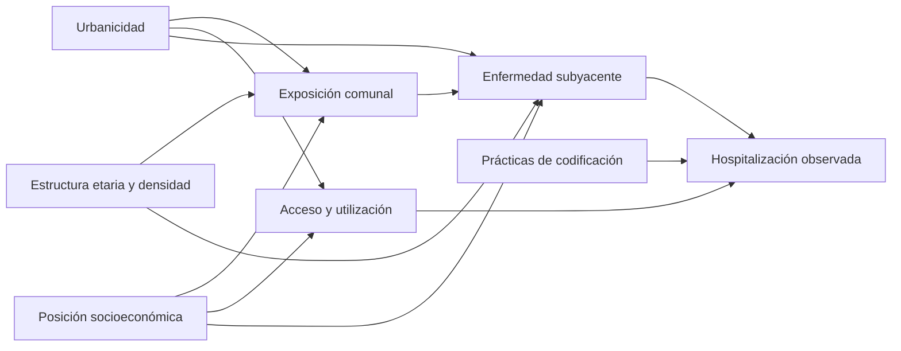

# Protocolo exposoma–hospitalizaciones con inferencia espacial

> Este documento especifica el análisis crónico/transversal v1. El análisis
> longitudinal independiente basado en productos anuales verificados se fija en
> [hospitalization_annual_v2_protocol.md](hospitalization_annual_v2_protocol.md).

> **Estado legacy:** esta inferencia transversal v1 terminó como
> `not_accepted`. Se conserva para auditoría histórica y pruebas de
> compatibilidad, pero no debe mezclarse con annual-v2, reutilizar su directorio
> de resultados ni presentarse como evidencia confirmatoria. No se planifica
> volver a ejecutar sus modelos; el análisis activo es el panel longitudinal
> annual-v2 y su extensión registrada de controles negativos v2.1.

**Versión:** 1.0  
**Estudio canónico:** `santiago_communes`  
**Unidad:** 52 comunas de la Región Metropolitana de Santiago  
**Desenlace principal:** egresos hospitalarios DEIS estandarizados indirectamente,
ventana 2018–2019  
**Estado:** protocolo fijado antes de ejecutar los modelos BYM2 de publicación

Este documento fija las decisiones analíticas que consume
`scripts/run_hospitalization_inference.py`. Las elecciones ejecutables viven en
`config/layers/neuro_hospitalizations.yaml`, bajo `analysis.inference`; cualquier
cambio posterior debe modificar la versión del protocolo y quedar reflejado en el
manifiesto. El análisis es ecológico: estima asociaciones de área y no efectos
individuales ni causales.

La versión científica se registra además como `protocol_version` en YAML y forma
parte de la huella reanudable. El manifiesto conserva el SHA-256 de este
documento, pero una corrección editorial no invalida trazas existentes; todo
cambio de hipótesis, estimando, prior, ventana o criterio debe incrementar
`protocol_version`.

## Alcance de producto y arquitectura

Este producto es **exclusivamente un análisis de datos offline**. No forma parte
del master exposómico, la API, `palette.json`, los exportadores ni la interfaz
web. Sus resultados permanecen bajo
`data/processed/cl/santiago/santiago_communes/analysis/hospitalizations/inference/`
y ninguna tarea de `exposome publish` los copia a `webapp/public/`. Una futura
visualización requerirá una decisión de producto, un contrato de datos y una
implementación separados; no se habilita implícitamente al terminar este análisis.

La capa base `neuro_hospitalizations` sí está registrada como comparador del
estudio para construir y verificar sus agregados, pero tiene
`master.include: false`; esto no publica la inferencia ni convierte
hospitalizaciones en un exposoma. El bloque declarativo `scope` refuerza el límite con `webapp: false`,
`exposome_master: false` y `automated_publish: false`, y la validación falla si
se cambia ese contrato accidentalmente.

La separación de responsabilidades es:

- `hospitalization_inference.py`: métodos estadísticos y contratos de datos;
- `inference_run_state.py`: registro, huellas, sidecars y NetCDF atómico;
- `hospitalization_inference_runner.py`: orquestación de fases y productos;
- `scripts/run_hospitalization_inference.py`: entrypoint delgado de 15 líneas.

Ninguno de estos módulos es importado por el runtime de la app. PyMC, ArviZ,
h5netcdf y h5py permanecen en el extra opcional `spatial` y sólo se importan al
iniciar muestreo.

## Pregunta, jerarquía y ventanas

La familia confirmatoria contiene `cardiovascular`, `respiratory`,
`respiratory_copd`, `cerebrovascular` y `mental_all`. La exposición confirmatoria
es PM2.5 histórico 2000–2017, la única completamente anterior a los egresos. NO₂
2024, NDVI 2024 y el índice social 2026 son análisis espaciales secundarios sin
interpretación temporal. Calor, contexto de sueño, ruido, caminabilidad,
transporte y entorno alimentario son exploratorios. El año 2020 aparece sólo en
la sensibilidad COVID; además se repiten 2018 y 2019 por separado.

Los diez desenlaces adicionales definidos en configuración forman una familia
FDR independiente de apéndice. `injury_poisoning` (S00–T98) es control negativo
sólo para PM2.5 y NO₂. No controla exposomas sociales porque infraestructura,
urbanicidad y acceso pueden afectar lesiones y utilización sanitaria.

## DAG y conjunto de ajuste



Los conteos esperados ya incorporan edad y sexo. La especificación `core` añade
NSE, porcentaje de 65+ y log-densidad poblacional como covariables ecológicas.
La sensibilidad `access` añade log de centros de atención primaria por 100.000
habitantes. Para el índice social el ajuste por acceso sigue siendo sensibilidad,
porque el acceso puede formar parte del mecanismo. No se imputan exposiciones:
se excluye una variable con menos de 45 comunas completas o menos de diez valores
distintos y se registra la razón.

## Correlaciones, multiplicidad y dependencia espacial

Para cada combinación principal se calcula Pearson sobre `log(SMR)`, Pearson
sobre SMR crudo, Spearman y Kendall sobre SMR, y Spearman parcial con `core` y
`access`. Se reportan IC bootstrap, p nominal y leave-one-commune-out, incluyendo
cambios de signo. Las correlaciones simples se rotulan como no espaciales y no
causales.

Los ajustes se realizan por método y familia: Holm y BH para PM2.5; BH separado
para secundarios, exposomas exploratorios y desenlaces exploratorios. Moran
bivariado usa contigüidad Queen y 9.999 permutaciones. Sus p-values permanecen
separados y nunca se presentan como corrección de una correlación clásica.

## Exposoma conjunto

Los indicadores se orientan temporalmente sólo para el análisis conjunto, de
modo que valores altos representen mayor carga; las tablas individuales conservan
la escala original. Se calculan Pearson, Spearman, VIF y clustering jerárquico.
Predictores con VIF >10 o |rho| ≥0,8 no se interpretan simultáneamente como
efectos individuales. PCA retiene componentes por análisis paralelo de Horn con
1.000 permutaciones.

Elastic-net Poisson usa `log(expected)` como offset exclusivamente para selección
predictiva exploratoria. Los cinco bloques espaciales se fijan desde centroides;
la selección usa validación cruzada anidada, `l1_ratio` 0,1/0,5/0,9/1,0 y 500
remuestreos de estabilidad. Una variable seleccionada debe volver al NB/BYM2 para
estimación; su coeficiente penalizado no es un efecto causal.

## Modelo NB–BYM2

Por desenlace y exposición se compara:

1. NB bayesiano no espacial con exposición y covariables;
2. NB–BYM2 sin exposición;
3. NB–BYM2 con exposición.

La media es

`log(mu_i) = log(expected_i) + intercepto + beta*x_i + gamma*z_i + bym2_i`.

Los predictores se estandarizan y `exp(beta)` es el RR por +1 DE. BYM2 mezcla un
ICAR Queen escalado con un efecto iid. Los coeficientes tienen Normal(0, 0,5),
`log(alpha)` tiene Normal(log(20), 1,5), el prior PC de desviación espacial
satisface `P(sigma > 1)=0,01`, y `rho` tiene Beta(0,5, 0,5), con Beta(1,1) como
sensibilidad. La implementación sigue la distribución
[ICAR oficial de PyMC](https://www.pymc.io/projects/docs/en/stable/api/distributions/generated/pymc.ICAR.html)
y el escalamiento del
[ejemplo BYM de PyMC](https://www.pymc.io/projects/examples/en/latest/spatial/nyc_bym.html).

PSIS-LOO compara los tres modelos y activa reloo exacto para Pareto-k >0,7. Se
reportan RR, HDI95%, probabilidad de dirección, probabilidad dentro de ROPE
0,95–1,05, desviación espacial, `rho`, sobredispersión y desempeño predictivo;
no se calcula p-value bayesiano. Los controles posteriores predictivos cubren
total, varianza, máximo y distribución comunal de conteos.

El muestreo normal usa cuatro cadenas, 2.000 warmup y 2.000 draws,
`target_accept=0,95`. Se exige cero divergencias, R-hat ≤1,01, ESS bulk/tail
≥400 y BFMI >0,30. Un fallo provoca un único reintento 4.000+4.000 con
`target_accept=0,99`; un segundo fallo queda como `failed_diagnostics` y se
excluye de interpretación.

## Criterio de evidencia y triangulación

Una señal se denomina **asociación ecológica robusta** sólo si converge, conserva
dirección entre NB y BYM2, su HDI95% excluye 1, la probabilidad de dirección es
≥0,975, no cambia con año/acceso/prior, no depende de una comuna y el control
negativo no reproduce el gradiente. Incluso entonces, sólo PM2.5 admite discusión
de precedencia temporal.

La disponibilidad de años adicionales y las brechas materializadas se mantienen
en la [auditoría temporal de exposiciones](hospitalization_exposure_temporal_coverage.md).
Las ampliaciones futuras serán análisis secundarios o exploratorios y no se
incorporarán retrospectivamente a una corrida confirmatoria iniciada.

Los desenlaces compatibles se contrastan descriptivamente con mortalidad
2018–2022. No se combinan productos ni se hace metaanálisis cuando definiciones o
ventanas no coinciden. La publicación se acepta únicamente cuando los cinco
modelos confirmatorios PM2.5 pasan diagnósticos, controles predictivos y
manifiesto; la replicación externa queda fuera de esta etapa.

## Ejecución reproducible

### Instalación

El único entorno admitido es `.venv` de Python 3.12, resuelto por `uv.lock`. El
extra `spatial` declara PyMC, ArviZ y los dos componentes necesarios para NetCDF
(`h5netcdf` y `h5py`); no se debe instalar ninguno con `pip`.

```bash
# Crea o sincroniza exactamente el entorno reproducible.
uv sync --all-extras

# Verifica el stack MCMC y el backend de trazas.
.venv/bin/python -c "import pymc, arviz, h5netcdf, h5py; print(pymc.__version__, arviz.__version__, h5netcdf.__version__, h5py.__version__)"
```

La resolución actualmente fijada en `uv.lock` instala PyMC 6.1, ArviZ 1.2,
h5netcdf 1.8 y h5py 3.16. El pipeline normal no importa PyMC: el costo y las
dependencias espaciales sólo aparecen al entrar en una fase bayesiana.

### Preparación local y productos clásicos

El control `injury_poisoning` quedó incorporado al agregador, pero el SMR
materializado antes de este protocolo no lo contiene. Regenerarlo es computación
local sobre archivos DEIS ya descargados y debe hacerse deliberadamente:

```bash
.venv/bin/python scripts/run_hospitalization_exposome_analysis.py

# Correlaciones, Moran, PCA/colinealidad, elastic-net y marcador de entradas.
.venv/bin/python scripts/run_hospitalization_inference.py \
  --mode classical \
  --phase all
```

El CLI de inferencia nunca invoca el agregador ni relee microdatos. Antes de MCMC
exige que el control exista y que los productos clásicos tengan la misma huella
de configuración, protocolo y archivos de entrada.

### Publicación por fases y reanudación

Primero se recomienda inspeccionar el plan. `--dry-run` y `--phase status` no
muestrean:

```bash
.venv/bin/python scripts/run_hospitalization_inference.py \
  --mode publication --phase status

.venv/bin/python scripts/run_hospitalization_inference.py \
  --mode publication --phase primary --dry-run
```

La ejecución de publicación se divide en unidades persistentes: 15 modelos
primarios, 2 controles negativos, 25 sensibilidades y 260 exclusiones de una
comuna. Correr desde la raíz del repositorio:

```bash
.venv/bin/python scripts/run_hospitalization_inference.py \
  --mode publication --phase primary --resume

.venv/bin/python scripts/run_hospitalization_inference.py \
  --mode publication --phase negative-controls --resume

.venv/bin/python scripts/run_hospitalization_inference.py \
  --mode publication --phase sensitivities --resume

.venv/bin/python scripts/run_hospitalization_inference.py \
  --mode publication --phase commune-loo --resume

.venv/bin/python scripts/run_hospitalization_inference.py \
  --mode publication --phase finalize --resume
```

`--resume` es el valor por defecto. Después de cada modelo se escribe primero
una traza `*.nc.partial`, se reabre mediante h5netcdf, se validan cadenas, draws y
variables posteriores, y sólo entonces se renombra atómicamente a `*.nc`. El
sidecar JSON incluye diagnósticos, huella científica y SHA-256 de la traza. Una
interrupción se retoma con el mismo comando; una traza huérfana, corrupta o
producida con otras entradas se rechaza en lugar de reutilizarse.

### Compatibilidad PSIS-LOO y recuperación

La extracción de PSIS-LOO acepta tanto los nombres históricos de ArviZ
(`elpd_loo`, `p_loo`, `loo_i`) como los expuestos por ArviZ 1.x/arviz-stats
(`elpd`, `p`, `elpd_i`). Antes de aplicar `reloo`, el runner comprueba que los
vectores puntuales de ELPD y Pareto-k tengan exactamente una observación por
comuna. Esto evita que un cambio de API se confunda con un fallo estadístico.

El error histórico `ELPDData object has no attribute loo_i` ocurría después del
muestreo, durante esa extracción, y antes de validar o promover la traza
temporal. Por ello no deja un modelo reutilizable ni requiere borrar archivos:
se recupera ejecutando otra vez la misma fase con `--resume`. La advertencia
`Pareto ... greater than 0.70` no es por sí sola un error; identifica comunas
para las que el pipeline debe realizar el refit LOO exacto previsto.

Los modelos que fallan dos veces los criterios MCMC quedan terminales como
`failed_diagnostics` y no se repiten con un `--resume` normal. Para reemplazarlos
intencionalmente, después de revisar la causa:

```bash
.venv/bin/python scripts/run_hospitalization_inference.py \
  --mode publication --phase primary --resume --rerun-failed
```

El preflight exige al menos 15 GiB libres y, después de contar con trazas, usa su
tamaño medio para proyectar el espacio pendiente. Las trazas y sidecars viven en
`analysis/hospitalizations/inference/traces/` y `run_state/models/`. Si se cambia
configuración, protocolo o entradas, se debe usar un `--output-dir` nuevo; nunca
mezclar corridas. `--phase all` existe para automatización, pero las fases
separadas son más fáciles de supervisar y reanudar.

Las pruebas MCMC de recuperación reducida se habilitan sólo con
`EXPOSOME_RUN_BAYESIAN_TESTS=1`; la suite normal prueba el contrato de 52 nodos y
la construcción y persistencia del modelo sin ejecutar cadenas largas:

```bash
PYTHONPYCACHEPREFIX=/tmp .venv/bin/python -m unittest \
  tests.test_hospitalization_inference

EXPOSOME_RUN_BAYESIAN_TESTS=1 PYTHONPYCACHEPREFIX=/tmp \
  .venv/bin/python -m unittest \
  tests.test_hospitalization_inference.BayesianRecoveryTest
```
